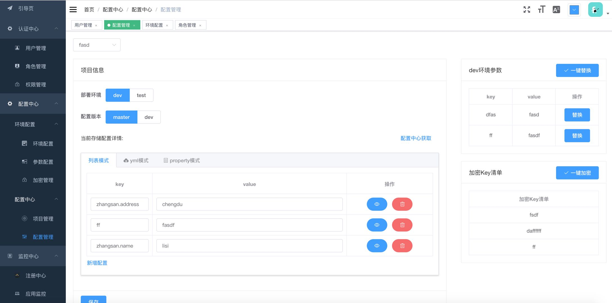
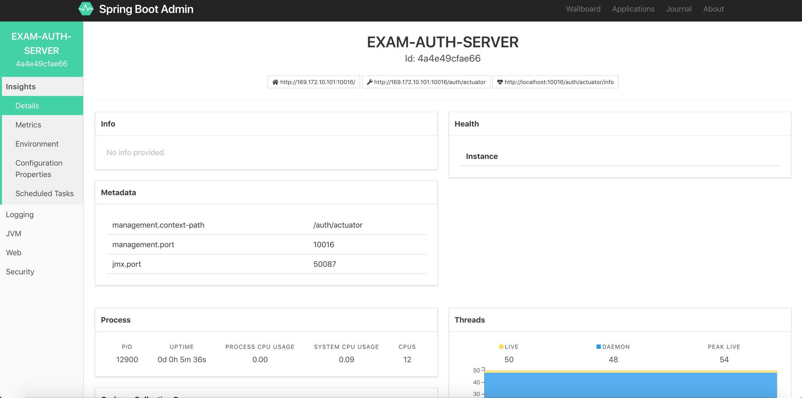
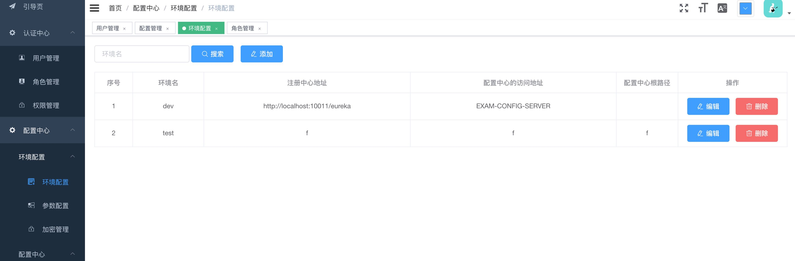

# examOnline
该项目是基于Spring cloud微服务架构来实现的在线考试系统，包括API网关、注册中心、配置中心、授权中心以及后端的服务。主要的业务功能可以参考另一个开源项目examstack。在该项目中同时也会使用到一些第三方的开源项目，如：Spring boot admin来处理应用的监控；scca来实现图形化的应用配置中心；等，

1. exam-eureka：通过eureka实现的服务注册中心
2. exam-config-server：基于数据库的配置中心
3. exam-config-admin：基于数据库的配置中心的rest服务
4. exam-user：用户中心
5. exam-auth：授权中心
6. exam-gateway：网关
7. exam-monitor：基于Spring boot admin的应用监控中心，实现服务下线通知

### 前端
前端通过vue-element-admin改造的后台，GitHub地址：[exam-admin](https://github.com/tlhhup/exam-admin)

1. 配置中心
	
	

2. spring boot admin监控

	
3. 注册中心

	

### 开发环境
1. jdk1.8+、maven、docker、docker-compose、mysql、idea

### 准备
1. docker
    1. redis容器

    		docker run --name redis-server -d -p 6379:6379 redis
    2. zipkin容器

    		docker run --name zipkin-server -d -p 9411:9411 openzipkin/zipkin